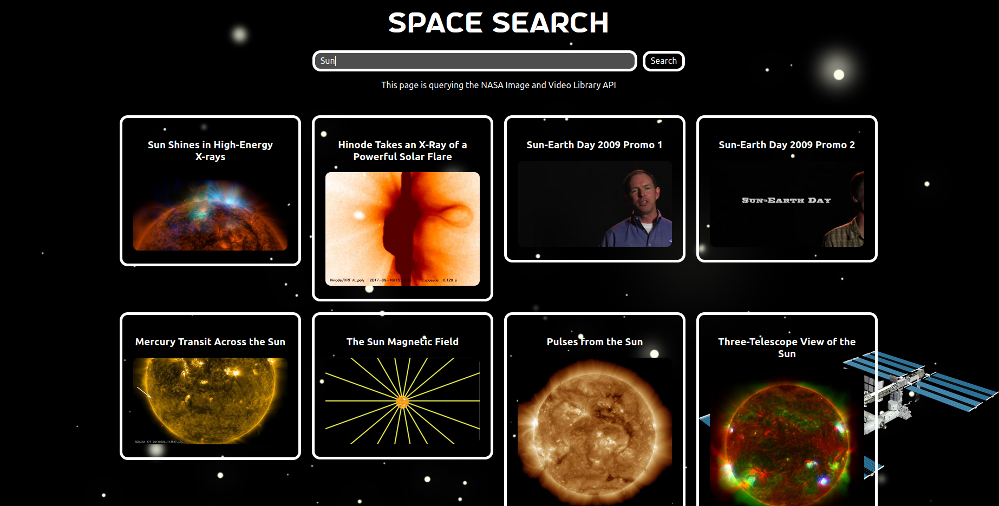

# Space Search App

A Graphical User Interface for the NASA Image and Video Library API ([API Documentation](https://images.nasa.gov/docs/images.nasa.gov_api_docs.pdf)). It's a React app written in TypeScript.



## Features

- Search the NASA Image and Video Library API

## Planned Features

- Add filter options for the search
- Add groupings of content by keywords or albums

## How to run/build

The web app can be run or built with npm scripts from the project root directory. See `package.json` for details.

### Prerequisites

Node.js and npm (Node Package Manager) have to be installed (I used Node.js 20).

For Windows or Mac visit https://nodejs.org/en and follow the instructions.

For Linux you can use nvm (Node Version Manager, https://github.com/nvm-sh/nvm) to install and manage Node and npm versions.

When using the project for the first time you have to run `npm install` from the project root directory to install dependencies which are defined in the package.json.

### Scripts

For development execute:

    npm run dev

To build the website for production execute:

    npm run build

Tests are written with Jest and can be run with:

    npm run test

## Tools

The project uses Vite and is based on the [Vite plus Redux TypeScript template](https://redux-toolkit.js.org/introduction/getting-started):

### vite-template-redux

Uses [Vite](https://vitejs.dev/), [Vitest](https://vitest.dev/), and [React Testing Library](https://github.com/testing-library/react-testing-library) to create a modern [React](https://react.dev/) app compatible with [Create React App](https://create-react-app.dev/)

```sh
npx degit reduxjs/redux-templates/packages/vite-template-redux my-app
```

#### Goals

- Easy migration from Create React App or Vite
- As beginner friendly as Create React App
- Optimized performance compared to Create React App
- Customizable without ejecting

## Support

If you are having issues, please let me know via the contacts on [my website](https://sjohannknecht.de).

## License

The project is licensed under the ISC license.
